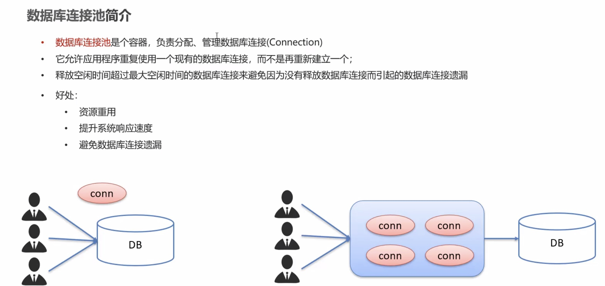

# JDBC 
## JDBC简介

1. 如何在项目中使用不同的数据库？
- 在项目中导入不同的jar包即可实现

## JDBC快速入门代码


1. 创建lib文件夹，导入jar包，add as library（global, project, module）
```java
// 1. 注册驱动 内部执行DriverManager方法
// MySQL 5以后，这行代码可以省略
Class.forName("com.mysql.jdbc.Driver");

// 2. 获取连接
String url = "jdbc:mysql://127.0.0.1:3306/lms";
String username = "root";
String password = "yyqx123456";
Connection conn = DriverManager.getConnection(url, username, password);

// 定义sql语句
String sql = "update lms.user set password = 123456 where id = 1";

// 4. 获取执行sql的对象statement
Statement stmt = conn.createStatement();

// 5. 执行sql
int count = stmt.executeUpdate(sql); // 受影响的行数

// 6. 处理结果
System.out.println(count);

// 7. 释放资源
stmt.close();;
conn.close();
```

## JDBC API详解
1. DriverManager
2. Connection
3. Statement
4. ResultSet
5. PreparedStatement

### DriverManager(驱动管理类)

>  作用：
> - 注册驱动
> - 获取数据库连接

```java
// 1. 注册驱动 - MySQL 5以后可以省略
Class.forName("com.mysql.jdbc.Driver");
// 2. 获取连接
// URL：协议 + ip地址 ：端口号/数据库名称
// String url = "jdbc:mysql://127.0.0.1:3306/sql_hr";

// 如果数据库是本机地址并且端口为3306，可简化书写
String url = "jdbc:mysql:///sql_hr";

// ?useSSL=false代表不使用安全连接方式
String url = "jdbc:mysql:///sql_hr?useSSL=false";
```

### Connection

>  作用：
> - 获取执行SQL的对象
> - 管理事务

#### 1. 获取执行SQL的对象

- 普通执行SQL对象(重点)
```java
Statement createStatement
```

- 预编译SQL的执行SQL对象：防止SQL注入(重点)
```java
PreparedStatement prepareStatement (sql)
```

- 执行存储过程的对象
```java
CallableStatement prepareCall (sql)
```
#### 2. 事务管理
> MySQL 事务管理
> - 开启事务：BEGIN;/START TRANSACTION；
> - 提交事务：COMMIT;
> - 回滚事务：ROLLBACK；
> 
> MySQL默认自动提交事务


> JDBC 事务管理：Connection接口中定义了3个对应的方法
> - 开启事务：setAutoCommit（boolean autoCommit）：true为自动提交事务；false为手动提交事务，即为开启事务
> - 提交事务：commit（）
> - 回滚事务：rollback（）

```java
try {
    //开启事务
    conn.setAutoCommit(false);

    int count1 = stmt.executeUpdate(sql1); 
    System.out.println(count1);

    int a = 5 / 0;

    int count2 = stmt.executeUpdate(sql2); 
    System.out.println(count2);

    // 提交事务
    conn.commit();
} catch (Exception e) {
    // 回滚事务
    conn.rollback();
    throw new RuntimeException(e);
}
```

保证数据库操作的同时性，一旦出现问题，都修改不成功

### Statement 

>  作用：
> - 执行SQL语句

#### 执行SQL语句


int count = stmt.executeUpdate(sql); 


- DDL:对表和库的增删改查
- DML：对数据的增删改
- DQL：对数据的查询操作

### ResultSet

```java
// 3. 定义sql
String sql = "select * from lms.user";

// 4. 获取执行sql的对象statement
Statement stmt = conn.createStatement();

// 5. 执行sql
ResultSet rs = stmt.executeQuery(sql); 

// 6. 处理结果
// 6.1 光标向下移动一行，并且判断当前行是否有数据
while (rs.next()) {
    // 6.2 获取数据 getXxx()
    int id = rs.getInt("id");
    String nickname = rs.getString("nickname");
    String phoneNumber = rs.getString("phone_number");
    int salary = rs.getInt("salary");

    System.out.println(id + "/" + nickname + "/" + phoneNumber + "/" + salary);
    System.out.println("-----------------------");
}
```

### PreparedStatement

> 作用：
>  - 预编译SQL语句并执行，预防SQL注入问题

> SQL 注入
> - SQL注入是通过操作输入来修改事先定义好的SQL语句，用以达到执行代码对服务器进行攻击的方法

```java
// 3. 接收用户输入的用户名和密码
String name = "xiaoming";
String pwd = "123";
String sql = "select * from lms.users where username = ? and password = ?";

// 获取pstmt对象
PreparedStatement pstmt = conn.prepareStatement(sql);

// 设置？的值
pstmt.setString(1, name);
pstmt.setString(2, pwd);

// 5. 执行sql
ResultSet rs = pstmt.executeQuery();

// 6. 判断是否登陆成功
if  (rs.next()) {
    System.out.println("登陆成功");
} else {
    System.out.println("登陆失败");
}

// 7. 释放资源
rs.close();
pstmt.close();;
conn.close();
```

#### PreparedStatement 原理

转译：' -> \'

## 数据库连接池



> Driud使用步骤
> - 导入jar包
> - 定义配置文件
> - 加载配置文件
> - 获取数据库连接池对象
> - 获取连接